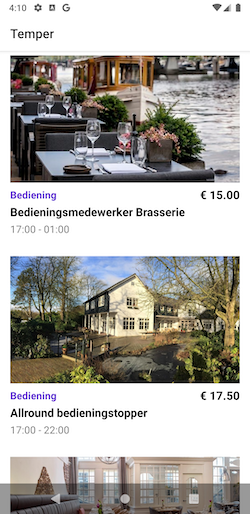

# Temper App
Android implementation

## Language & Libraries
- Kotlin
- Koin (dependency injection)
- Paging library
- Navigation component
- Lottie
- Coroutines
- Glide
- Retrofit 2
- OkHttp
- Junit
- Mockito
- MockWebServer
- Espresso

## Modules
The project has four modules
- App: Activity, fragment, ViewModel, adapter, navigation
- Data: Paging, Repository, Http client
- Model: Model's mapping
- MockWebServer: Base module to mockWebServer be reused for other modules

## Approach
- All the layers make use of dependency injection to provide all your dependencies, using Koin framework
- The UI layer makes use of the MVVM pattern to communicate between View and ViewModel
- The UI makes use of the ViewModel component to be lifecycle-aware
- The communication between the UI and repository is done by live data (data and status)
- The images are loaded and cached by the Glide library
- The repository is encapsulated by the paging library to support pagination
- The data layer makes use of the repository pattern to fetch the remote data (with coroutines and retrofit)
- The tests that require external communication are mocked with OkHttp MockWebServer
- The project contains 2 flavors, develop and mock
    - Develop is the normal implementation of the app
    - Mock makes use of the mockWebServer to force responses (the journey test lies in this layer)

## Tests
To run the tests make use of the following commands

Unit tests
> ./gradlew test

UI Tests (Journey)
> ./gradlew connectedMockDebugAndroidTest
- Don't forget to open the emulator :)

